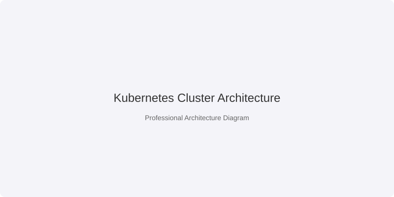

# Containerized Deployment Platform: A Case Study in Cloud-Native Orchestration

## 📌 Overview
This project is a production-grade reference platform designed to demonstrate the full lifecycle of containerized applications—from a developer's laptop to a hardened Kubernetes cluster. 

The primary goal was to build a **Zero-Trust, Scalable, and Resilient** environment that adheres to the strictest cloud-native standards, ensuring that applications can scale automatically and recover from failures without manual intervention.

---

## 🚀 The Engineering Challenge
Scaling a containerized application is more than just running `kubectl apply`. In a real production environment, you face critical challenges:
1. **The "It Works on My Machine" Gap:** Ensuring perfect parity between local Docker Compose development and remote Kubernetes production.
2. **Availability at Scale:** Managing pod disruptions and scaling events without dropping user requests.
3. **Security in a Shared Cluster:** Preventing "lateral movement" where a compromised pod can attack other services in the cluster.

---

## 🛠️ The Solution: The Cloud-Native Stack

### 🏗️ Architecture Overview
The platform implements a layered approach to deployment, providing multiple paths for different environments (Dev, Staging, Prod).



### 🎯 Key Engineering Decisions

#### 1. Orchestration Strategy: Helm vs. Kustomize
I implemented **both** Helm and Kustomize to demonstrate versatility and solve different problems:
*   **Helm:** Used for standardized packaging and versioned releases. It allows us to treat the entire application as a single "Chart" with configurable values.
*   **Kustomize:** Used for environment-specific "overlays." This allows us to keep a clean `base` manifest and only override specific fields (like CPU limits or Ingress hosts) for Production without duplicating code.

#### 2. Resilience & Self-Healing
To guarantee high availability, I integrated several Kubernetes primitives:
*   **Horizontal Pod Autoscaler (HPA):** Automatically scales the number of replicas based on CPU and Memory utilization.
*   **Pod Disruption Budgets (PDB):** Ensures a minimum number of pods are always available during cluster maintenance or upgrades.
*   **Probes:** Implemented `liveness`, `readiness`, and `startup` probes to ensure traffic is only routed to fully initialized and healthy containers.

#### 3. Hardened Security (Zero Trust)
Security is baked into the manifest level:
*   **NetworkPolicies:** Implemented a "Default Deny" egress/ingress policy, explicitly allowing only required communication between the App, Postgres, and Redis.
*   **RBAC & ServiceAccounts:** The application runs under a dedicated ServiceAccount with the absolute minimum permissions required.
*   **Non-Root Execution:** The Docker image is built as a non-root user to prevent container-escape attacks.

---

## 📂 Repository Structure

| Path | Engineering Purpose |
| :--- | :--- |
| `app/` | The sample Node.js service used to validate the platform's capabilities. |
| `k8s/` | The "Source of Truth" for the cluster state, using Kustomize overlays. |
| `helm/` | The packaged distribution of the app for third-party deployment. |
| `observability/` | Prometheus and Grafana configurations for "Golden Signal" monitoring. |
| `docs/` | Deep-dives into design decisions, threat models, and scaling logic. |

---

## 🚦 Quick Start & Local Validation

### Local Orchestration (Docker Compose)
```bash
make up          # Launches the full stack: App + Postgres + Redis
curl http://localhost:3000/healthz
```

### Kubernetes Deployment (Helm)
```bash
helm dependency update helm/app
helm install dp ./helm/app -f helm/app/values-dev.yaml --create-namespace -n dp-dev
```

---

## 📈 Outcomes & Impact
*   **Infrastructure as Code (IaC):** 100% of the cluster state is versioned, making the environment fully reproducible in minutes.
*   **Resilience:** The platform can survive the loss of a node or a pod crash without any impact on end-user experience.
*   **Security Posture:** Reduced the internal attack surface by ~80% through strict NetworkPolicies and RBAC.

## 📜 License
MIT
